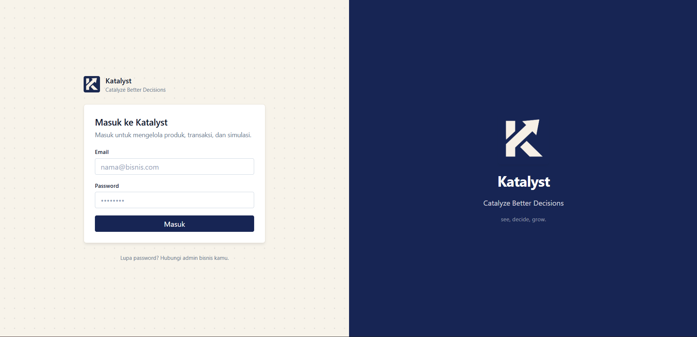
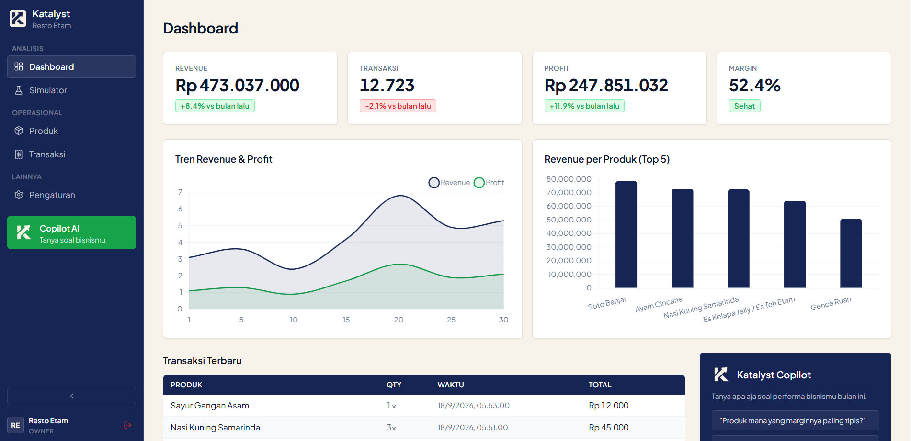
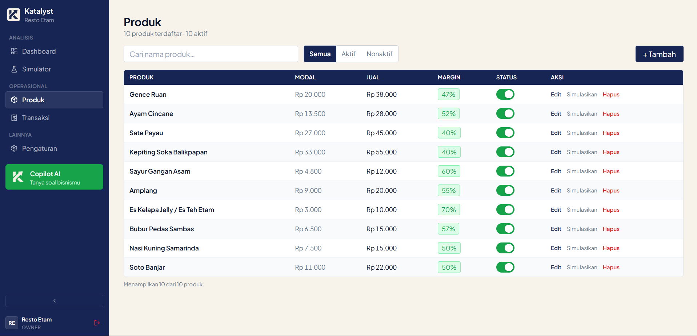
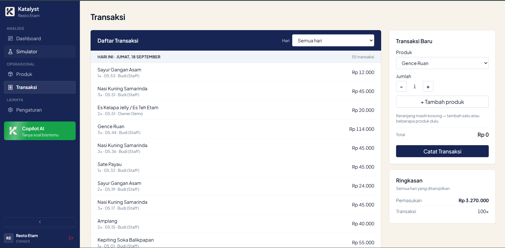
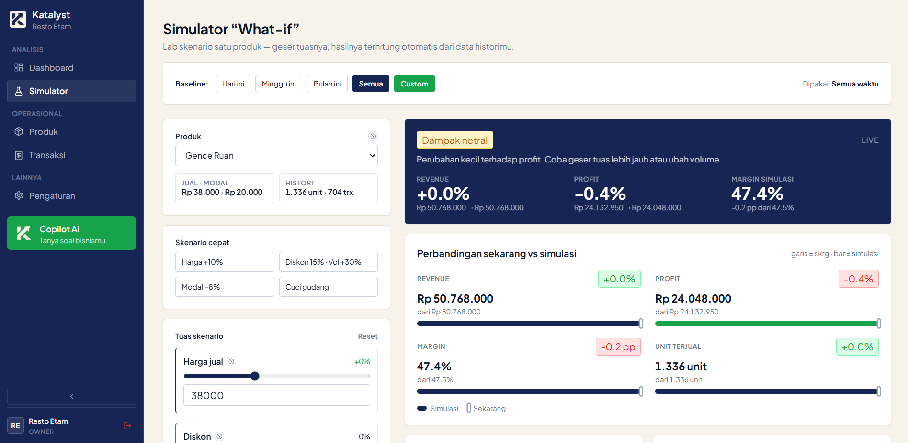
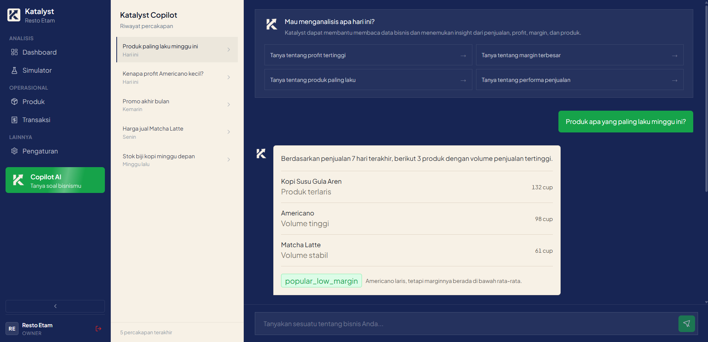

# Katalyst

Aplikasi pendukung keputusan bisnis untul UMKM: catat penjualan harian, lihat untung-rugi sebenarnya (bukan cuma omzet), dan uji skenario harga sebelum diterapkan disertai fitur copilot.

Semua angka (omzet, modal, untung, margin) dihitung langsung dari data transaksimu dengan rumus pasti dan konsisten — AI hanya membantu menjelaskan maksudnya, tidak ikut mengarang angka.

## Fitur

- **Dashboard owner** — KPI revenue, transaksi, profit, margin + tren harian 30 hari terakhir dan delta vs 30 hari sebelumnya, top 5 produk, transaksi terbaru, dan insight otomatis (misal produk laris tapi margin tipis).
- **Produk** — CRUD, aktif/nonaktif, badge margin, halaman detail per produk (terjual, revenue, profit, margin) + deep-link ke simulator.
- **Transaksi (kasir)** — keranjang multi-produk, 1 struk tersimpan sebagai 1 transaksi + N item dengan snapshot harga. Riwayat dikelompokkan Hari > Struk > Item + subtotal. Struk yang salah catat dibatalkan utuh oleh owner lalu dibuatkan struk koreksi (tanpa edit diam-diam, biar teraudit).
- **Simulator "what-if"** — lab satu produk: geser harga jual, diskon, modal, volume, langsung lihat dampak revenue/profit/margin, titik impas, dan diskon maksimum. Baseline bisa hari ini, minggu ini, bulan ini, atau custom.
- **Copilot** — tanya jawab soal performa bisnis berbasis angka yang sama.
- **Pengaturan** — identitas bisnis + kelola staff (tambah/hapus, role OWNER/STAFF). Riwayat struk staff yang sudah dihapus tetap menampilkan namanya.

## Preview

## Cara jalan

1. `cp .env.example .env`, isi `DATABASE_URL` (Neon, pooled endpoint) dan `BETTER_AUTH_SECRET`
2. `npm install`
3. `npx drizzle-kit migrate`
4. `npm run db:seed` (data demo: Resto Etam, 10 menu, 90 hari transaksi)
5. `npm run dev`

Akun demo setelah seed:

| Role  | Email            | Password   | Mendarat di     |
| ----- | ---------------- | ---------- | --------------- |
| Owner | `owner@test.com` | `password` | `/dashboard`    |
| Staff | `staff@test.com` | `password` | `/transactions` |

## Tech stack

- SvelteKit
- Tailwind CSS
- Drizzle ORM
- Postgres (Neon)
- better-auth
- Chart.js
- Cloudflare Pages (Deployment)

  
  

  Built with ☕ by <a href="https://flaid.my.id"><strong>Flaid</strong></a> — Full-stack Developer & Indie Builder

